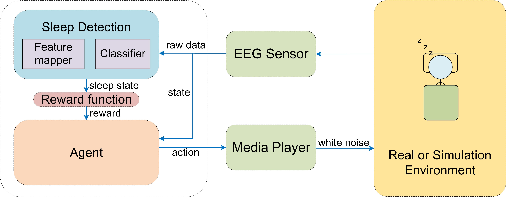

# RLSF
### RLSF: Multimodal Sleep Improvement Algorithm based Reinforcement Learning
#### *by: Nan Che, Tao Zhang, Yuandi Li, Fei Yu, Haitao Wang* 


## Abstract

As informatization 3.0 accelerates the pace of people's life and work, people's happiness index and physical and mental health have become the focus of attention and research in sociology, psychology and medicine. Currently, neurological diseases represented by insomnia have become common chronic diseases. However, existing insomnia treatment methods mainly focus on drug therapy and EEG-based expert intervention, ignoring the individual variability of insomnia patients, the high cost of expert intervention, and the privacy of the user's treatment environment. Therefore, aiming at the effect of white noise lite on sleep quality, this paper proposes a time-frequency domain correlation multimodal sleep enhancement framework based on reinforcement learning (RLSF), which is a closed-loop feedback sleep improvement framework that includes hardware and software. Specifically, the individual sleep state is fed for learning through EEG sensors’ input, and the agent is gradually trained to suit the sleep habit. This paper provides a reinforcement learning environment in which different agents can be deployed easily; then, we propose the Deep Net Sleep Improvement agent (DNSI agent) and the Time and Frequency-based Lightweight Sleep Improvement agent (TFLSI agent) for RLSF. Finally, the substantial experiments compare DNSI and TFLSI agent performance, and the results indicate that these two agents both have decision-making ability, and three volunteers’ Pittsburgh Sleep Quality Index significantly reduces by 3-7 points within two months and the average time to sleep is reduced by 131.4 seconds. 


## Requirmenets:
- Python3.7
- Pytorch==1.4
- Numpy==1.21.5
- numba==0.55.2
- Sklearn==1.0.2
- Pandas==1.3.4
- openpyxl==3.0.9
- mne==0.20.7
- pyserial==3.5
- pygame==2.1.2 
- pynvml==11.4.1
- scipy==1.7.3
- tensorboard=2.9.1
- tslearn==0.5.2
- pywin32==304

## Prepare datasets
> The processed TGAM datasets are now available [on this Dataverse](https://github.com/TerryZAG/TGAM-datasets-for-RLSF.git)

We used one public datasets in this study:
- [Sleep-EDF-20](https://gist.github.com/emadeldeen24/a22691e36759934e53984289a94cb09b)


After downloading the public datasets, you can prepare them as follows:
```
cd prepare_datasets
python prepare_physionet.py --data_dir /path --output_dir edf_20_npz --select_ch "EEG Fpz-Cz"
```

## Training RLSF 
For run the RLSF, you have to select the corresponding `config.json` file.
- To test sleep detection through public dataset Sleep-EDF,  you need to select config-001
- To train the sleep detection model, you need to select config-002
- To run TFLSI agent in a simulation environment, you need to select config-003
- To run DNSI agent in a simulation environment, you need to select config-004
- To run TFLSI agent in a real environment, you need to select config-005

Train sleep detection model on public dataset Sleep-EDF
```
python train_sleep_stage.py --device 0 --fold_id 0 --np_data_dir data/edf_20_npz
```

Train sleep detection model
```
python train_sleep_stage.py --device 0 --fold_id 0 --np_data_dir data/sleep_stage_data_tgam
```

Run TFLSI agent in a simulation environment
```
python train_RLSF_TFLSI_agent_simu.py
```

Run DNSI agent in a simulation environment
```
python train_RLSF_DNSI_agent_simu.py
```

Run TFLSI agent in a real environment
```
python train_RLSF_TFLSI_agent_simu.py
```

Run the device occupancy statistics script
```
python start_SystemPerMonitor.py
```


## Results
The logs and results are saved in the folder "saved"
